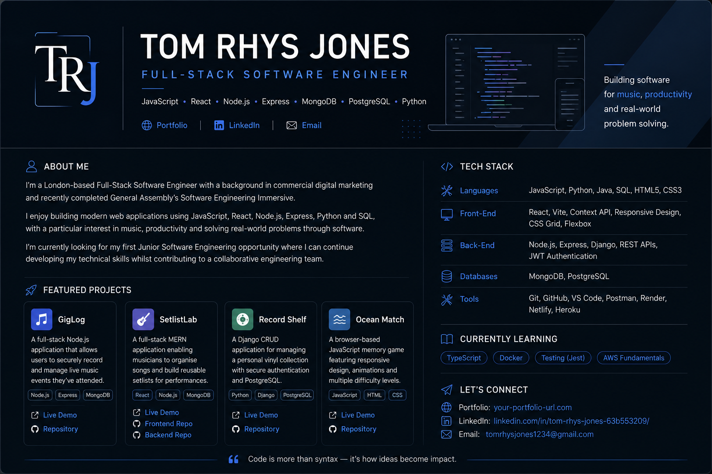

  

<h1 align="center">Hi, I'm Tom Rhys Jones 👋</h1>

<h3 align="center">Full-Stack Software Engineer | JavaScript • React • Node.js • Express • MongoDB • PostgreSQL • Python</h3>

  <a href="YOUR_PORTFOLIO_URL">Portfolio</a> •
  <a href="https://www.linkedin.com/in/tom-rhys-jones-63b553209/">LinkedIn</a> •
  <a href="mailto:tomrhysjones1234@gmail.com">Email</a>

---

## 👨‍💻 About Me

I'm a London-based Full-Stack Software Engineer with a background in commercial digital marketing and recently completed General Assembly's Software Engineering Immersive.

I enjoy building modern web applications using JavaScript, React, Node.js, Express, Python and SQL, with a particular interest in music, productivity and solving real-world problems through software.

I'm currently looking for my first Junior Software Engineering opportunity where I can continue developing my technical skills whilst contributing to a collaborative engineering team.

---

## 🛠️ Tech Stack

### Languages

- JavaScript (ES6+)
- Python
- Java
- SQL
- HTML5
- CSS3

### Front-End

- React
- Vite
- Context API
- Responsive Design
- CSS Grid
- Flexbox

### Back-End

- Node.js
- Express
- Django
- REST APIs
- JWT Authentication

### Databases

- MongoDB
- PostgreSQL

### Tools

- Git
- GitHub
- VS Code
- Postman
- Render
- Netlify
- Heroku

---

# 🚀 Featured Projects

## 🎵 GigLog

A full-stack Node.js application that allows users to securely record and manage live music events they've attended.

**Tech Stack:** Node.js • Express • MongoDB • Mongoose • EJS

🔗 **Live Demo:** YOUR_LINK

🔗 **Repository:** YOUR_LINK

---

## 🎸 SetlistLab

A full-stack MERN application enabling musicians to organise songs and build reusable setlists for live performances.

**Tech Stack:** React • Node.js • Express • MongoDB • JWT

🔗 **Live Demo:** YOUR_LINK

🔗 **Front-End Repository:** YOUR_LINK

🔗 **Back-End Repository:** YOUR_LINK

---

## 💿 Record Shelf

A Django CRUD application for managing a personal vinyl collection with secure authentication and PostgreSQL.

**Tech Stack:** Python • Django • PostgreSQL

🔗 **Live Demo:** YOUR_LINK

🔗 **Repository:** YOUR_LINK

---

## 🌊 Ocean Match

A browser-based JavaScript memory game featuring responsive design, animations and multiple difficulty levels.

**Tech Stack:** JavaScript • HTML • CSS

🔗 **Live Demo:** YOUR_LINK

🔗 **Repository:** YOUR_LINK

---

## 📫 Let's Connect

I'm always happy to connect with software engineers, recruiters and fellow developers.

🌐 **Portfolio:** YOUR_PORTFOLIO_URL

💼 **LinkedIn:** https://www.linkedin.com/in/tom-rhys-jones-63b553209/

📧 **Email:** tomrhysjones1234@gmail.com
